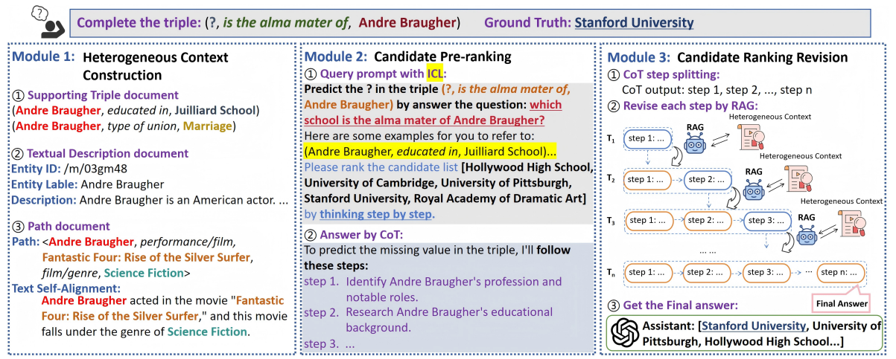

# ICRE-COT

The repository of paper: "ICRE-COT: A RETRIEVAL-REVISED TWO-STAGE RANKING FRAMEWORK FOR LLM-BASED KNOWLEDGE GRAPH COMPLETION"



#### Section 1. Prepare the Datasets

Before executing the code, please download the supplement data for fb1k-237 and wn18rr datasets first and organize them into the datasets/fb1k-237 and datasets/wn18rr directory according to the repository structure:

https://drive.google.com/file/d/1Gsk_OOQcITW1TJxjwloPcL1SKz0bDAZe/view?usp=sharing

We use text self-alignment files for relations for both datasets from KICGPT and we put them under datasets/fb15k-237/alignment/ and datasets/wn18rr/alignment/.

We use Rotate to produce the initial candidate list, you can also repace it as  other KGC models if you want. You only need to name your candidate list file as *test_answer.txt* and put this file into the datasets/fb1k-237 and datasets/wn18rr directory respectively.

#### Section 2. Heterogeneous Context Construction

Running commands to generate context files

```
python entity_description_query.py --dataset fb15k-237
python entity_description_query.py --dataset wn18rr
```

The produced context files are under datasets/fb15k-237/description/ and datasets/wn18rr/description/.

#### Section 3. Retrieval-Revised Two-stage Ranking for Link Prediction

##### Link Prediction by directly performing two-stage candidate re-ranking

```
python rat-context.py --dataset fb15k-237 --query tail
python rat-context.py --dataset fb15k-237 --query head
python rat-context.py --dataset wn18rr --query tail
python rat-context.py --dataset wn18rr --query head
```

After running the link_prediction, the chatlog and output results are under the outputs/ directory. Text self-alignment is optional by appending --align_text at the tail of the following link prediction running commands.

Note: remember to specify your own OpenAI API key and BASE_URL in arguments --api_key and codes.
